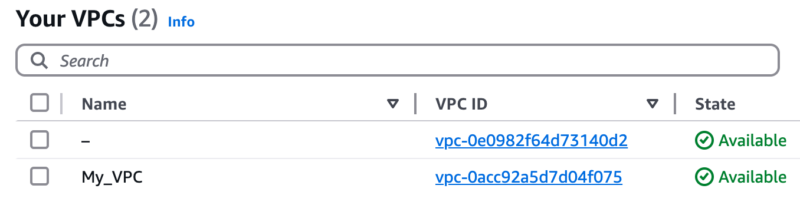

# Packer-Terraform AWS Infrastructure Guide

This guide walks you through creating a custom Amazon Machine Image (AMI) with Packer and then using Terraform to provision a secure infrastructure with a bastion host and private instances.

## Step 1: Creating a Custom AMI with Packer

### Prepare SSH Keys
```bash
# Set correct permissions for your private key
chmod 600 private-key.pem

# Generate a public key from your private key
ssh-keygen -y -f /path/to/your/private-key.pem > publickey.pub
```

### Configure AWS Credentials
```bash
# Export your AWS credentials as environment variables
export AWS_ACCESS_KEY_ID=your_access_key
export AWS_SECRET_ACCESS_KEY=your_secret_key
export AWS_SESSION_TOKEN=your_session_token  # if using temporary credentials

# Export your public key for Packer to use
export SSH_PUBLIC_KEY=$(cat publickey.pub)
```

### Build the AMI with Packer
```bash
# Initialize Packer plugins
packer init .

# Build the custom AMI
packer build .
```


*Successfully created custom AMI with Packer*

## Step 2: Provision Infrastructure with Terraform

### Update Configuration
1. Get your current public IP address:
   ```bash
   curl -4 icanhazip.com
   ```

2. Update `vars.tf` with:
   - Your public IP address (format: x.x.x.x/32)
   - The AMI ID from the Packer build output

### Provision Resources
```bash
# Initialize Terraform
terraform init

# Validate the configuration
terraform validate

# Format the configuration files
terraform fmt

# Create the infrastructure
terraform apply
```

*VPC architecture with public and private subnets*


*Security groups successfully created*


*Public and private subnets created across availability zones*


*Terraform outputs showing the created resources*

### Access Your Instances

1. Extract the IP addresses from Terraform outputs:
   ```bash
   # Get the public IP of the bastion host
   terraform output BastionPublicIP
   
   # Get the private IPs of your instances
   terraform output PrivateIPs
   ```

2. Add your private key to the SSH agent:
   ```bash
   ssh-add /path/to/your/privatekey.pem
   ```

3. Connect to the bastion host:
   ```bash
   ssh ec2-user@<bastion-public-ip>
   ```
   
   
   *Successfully connected to the bastion host*

4. From the bastion, connect to any private instance:
   ```bash
   ssh ec2-user@<private-instance-ip>
   ```
   
   
   *Connected to a private instance through the bastion host*

## Infrastructure Architecture

- **VPC**: Isolated network environment with public and private subnets
- **Bastion Host**: Located in a public subnet, accessible only from your IP address
- **Private Instances**: 6 EC2 instances in private subnets, accessible only through the bastion host
- **Security**: Restricted SSH access and proper network segmentation

## Cleanup

When you're done with the infrastructure:
```bash
terraform destroy
```

This will remove all AWS resources created by Terraform to avoid ongoing charges.
